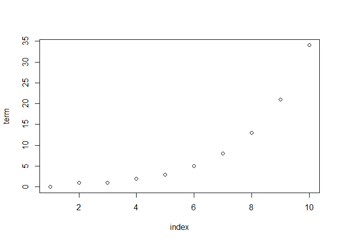
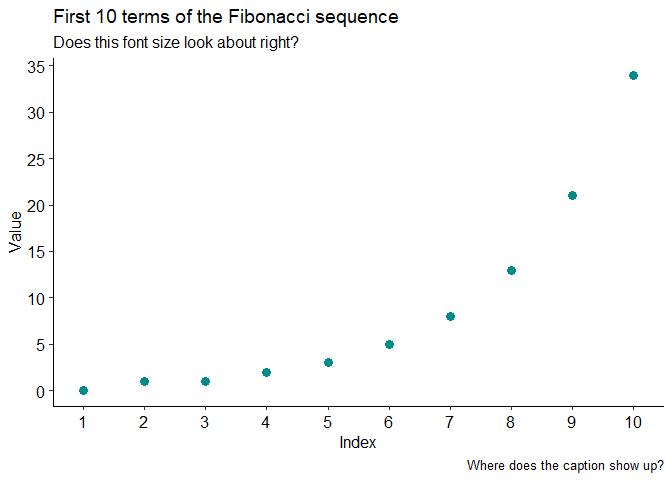
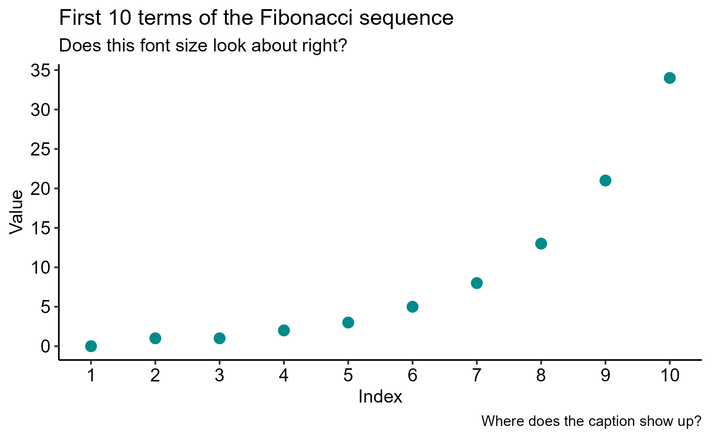

# Troubleshooting Git with Fibonacci

This repo tests whether Git, GitHub, and RStudio are playing well
together on my personal machine.

This repo also tests rendering of a code snippet, a figure, and an
external image in Quarto.

## What was Fibonacci’s deal?

Turns out Leonardo Bonacci was a medieval mathematician from Pisa. His
*Liber Abaci*, published in 1202, brought Indo-Arabic numerals to the
European mainstream and demonstrated a neat sequence. I did not realize
Europeans stuck to Roman numerals for so long; must’ve been good for
abacus makers. Thanks,
[Wikipedia](https://en.wikipedia.org/wiki/Fibonacci)!

This page from *Liber Abaci* shows the Fibonacci sequence in multiple
numeral forms. It’s also a test link.


This code snippet and the corresponding figure are tests of Quarto’s
formatting.

``` r
library(dplyr, quietly = TRUE, warn.conflicts = FALSE)
library(ggplot2, quietly = TRUE)
library(ggpubr, quietly = TRUE)
library(magrittr, quietly = TRUE, warn.conflicts = FALSE)
library(purrr, quietly = TRUE, warn.conflicts = FALSE)

# Get the first 100 terms of the Fibonacci sequence in a tidy format.
fibonacci = 
  tibble(index = seq(1, 10),
         term = c(0, 1, rep(NA, max(index) - 2)))

# This isn't the most satisfying way to do this, but it is concise.
for(i in 3:max(fibonacci$index)) {
  fibonacci$term[[i]] = fibonacci$term[[i - 2]] + fibonacci$term[[i - 1]]
}

# Print terms.
fibonacci %>% print
```

    # A tibble: 10 × 2
       index  term
       <int> <dbl>
     1     1     0
     2     2     1
     3     3     1
     4     4     2
     5     5     3
     6     6     5
     7     7     8
     8     8    13
     9     9    21
    10    10    34

``` r
# Plot terms.
fibonacci %>% plot
```



``` r
# Plot terms again, but this time in a classier figure to test image options.
fibonacci %>% 
  ggplot() +
  geom_point(aes(x = index,
                 y = term),
             color = "darkcyan", 
             size = 3) + 
  scale_x_continuous(expand = c(0.05, 0.05),
                     breaks = 1:10) +
  scale_y_continuous(expand = c(0.05, 0.05),
                     breaks = seq(0, 35, by = 5)) +
  labs(x = "Index",
       y = "Value",
       title = "First 10 terms of the Fibonacci sequence",
       subtitle = "Does this font size look about right?",
       caption = "Where does the caption show up?") +
  theme_pubr()
```



``` r
# Save the classier figure to check the difference in Quarto rendering.
ggsave("troubleshooting_git.png",
       dpi = 300,
       width = 6.5,
       height = 4,
       bg = "transparent")
```

This figure is the same as the last one, but it’s saved to disk and then
referenced in rendering.



## [What did we learn?](https://www.youtube.com/watch?v=kCXTq-fWWio)

- Wikipedia is great for setting up trivial coding problems and fun
  facts.

- Leonardo Bonacci was more interesting than I thought.

- Git, GitHub, and RStudio (with Quarto) are all working together and
  Quarto is great. Success!
